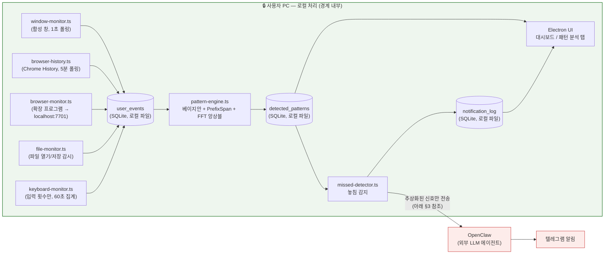

# Privacy Design

Pattern Bridge's core privacy property is architectural, not policy-based:
every stage that touches raw behavioral data — collection, storage, and
pattern analysis — runs as a local process on the user's own machine, reading
and writing a local SQLite file. Nothing outside that boundary ever receives
raw events. This document describes the boundary precisely: what crosses it,
what is collected at all, and what is deliberately never collected.

## 1. Architecture: everything left of the boundary is local



Everything inside the green boundary — collectors, the SQLite database
(`data/pattern-bridge.sqlite`), the three-algorithm pattern engine, the
missed-pattern detector, and the Electron dashboard — runs as local processes
reading and writing local files. No component inside the boundary makes an
outbound network call. The single edge that crosses the boundary is the
webhook call from `missed-detector` (via `openclaw-client.ts`) to OpenClaw,
described in §3.

## 2. What is collected, and what is deliberately never collected

| Collector | Action logged | Fields stored | Explicitly NOT stored |
|---|---|---|---|
| `window-monitor.ts` | `window_focus` | app name, window **title text**, platform, process id | — (title text is stored; see note below) |
| `browser-history.ts` / `browser-monitor.ts` | `browser_url` | URL, page title | page content, form data, cookies |
| `keyboard-monitor.ts` | `keyboard_activity` | **count** of keydown events per 60 s window | which keys were pressed, any typed text/content |
| `file-monitor.ts` | `file_open` / `file_save` | file path, extension | file content |

Note on window titles and URLs: these *are* collected and stored locally,
because the pattern-mining algorithms need them (e.g. distinguishing "Chrome
— Gmail" from "Chrome — YouTube" is what makes time-of-day and sequence
detection useful at all). This is a deliberate trade-off, not an oversight —
the mitigation is that this data never leaves the local SQLite file (§1) and
is never included in what is sent to OpenClaw (§3).

Categorically never collected, regardless of collector:

- **Keystroke content.** `keyboard-monitor.ts` increments an in-memory
  counter on every `keydown` and flushes only the aggregate count once per
  minute (`{ count, windowMs }`); the actual key values are never read from
  the counter's scope, so there is nothing to persist even accidentally.
- **File content.** `file-monitor.ts` logs the path and extension of files
  added/changed under Desktop/Documents/Downloads; it never opens or reads
  the file.
- **Screen or audio recording.** No collector captures screenshots, screen
  video, or microphone audio.
- **Clipboard contents.**
- **Credentials, cookies, or session tokens** from the browser history
  database — only `url`, `title` are selected from Chrome's `History`
  SQLite file (see the query in `browser-history.ts`), and only non-hidden,
  non-`data:`/`blob:`/`chrome-extension:` visits.

## 3. What crosses the boundary: abstracted signals, not raw data

The only outbound network call in the system is
`sendWebhook()` in `src/trigger/openclaw-client.ts`, invoked once per pending
detected pattern or missed-pattern event. Its payload is:

```json
{
  "message": "패턴 놓침 감지: 매일 09:00 Google Chrome (32분 경과, 신뢰도 87%). 사용자에게 자연스럽게 한국어로 알려주세요.",
  "name": "PatternBridge",
  "deliver": true,
  "channel": "telegram",
  "to": "<telegram-chat-id>"
}
```

The `message` string is built by `buildMessage()` from a `PatternResult`'s
**evidence object** — the same structured fields already visible in the
Electron UI's pattern list: pattern type, app name, hour-of-day or sequence
label, and the ensemble/per-algorithm confidence scores. It is a *description
of a detected regularity* ("this app is usually opened at this time, with
this much statistical confidence"), not a transcript of what the user did.
Concretely, OpenClaw receives:

- ✅ "Google Chrome is usually opened around 09:00, 32 minutes overdue today,
  87% confidence" (abstracted pattern signal)
- ❌ never: the window titles, URLs, or raw event timestamps that produced
  that pattern
- ❌ never: keystroke counts, file paths, or any other collector's raw
  output

If `PatternResult.evidence` has no human-readable `description` field, the
fallback path (`JSON.stringify(pattern)`) still only serializes the
`PatternResult` — `{ userId, patternType, score, evidence }` — where
`evidence` is itself already the abstracted, pre-aggregated output of the
pattern engine (app name, hour, sequence array, per-algorithm scores). At no
point does any code path forward the contents of `user_events` (raw window
titles, URLs, or event-level timestamps) to `sendWebhook()`.

## 4. Local storage summary

| Store | Location | Leaves the device? |
|---|---|---|
| `user_events` (raw collector output) | `data/pattern-bridge.sqlite` | Never |
| `detected_patterns` (pattern engine output) | `data/pattern-bridge.sqlite` | Never |
| `notification_log` (evaluation / feedback log, this work) | `data/pattern-bridge.sqlite` | Never |
| Abstracted pattern description (§3) | — (in-memory message string) | Yes — to OpenClaw, over HTTPS webhook, on missed-pattern detection only |

This means the precision-evaluation additions in this work
(`notification_log`, the 👍/👎 UI, `scripts/eval-report.ts`,
`scripts/run-ablation.ts`) introduce no new privacy surface: they read and
write the same local SQLite file and never touch the network path.
